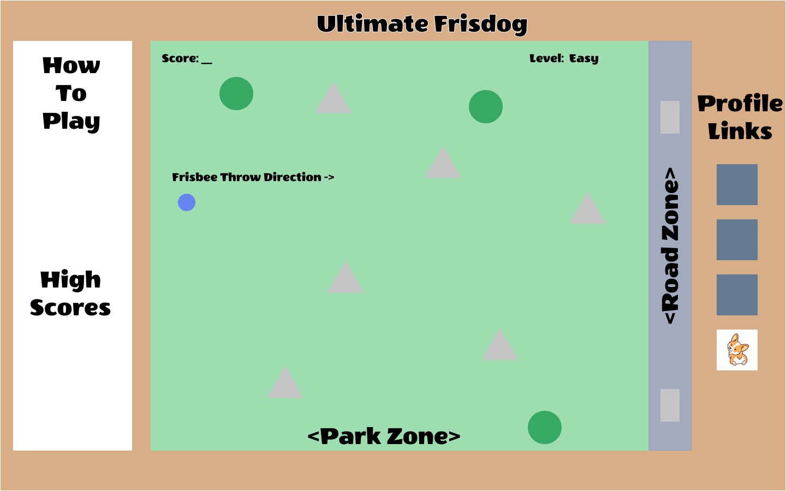

# Ultimate Frisdog

## Background and Overview
You're out at the dog park with your human and want to show off your frisbee-catching skills despite your short legs!

Use your cursor to catch as many frisbees as possible or else your human will want to go home. Avoid other dogs and obstacles in the park, and don't let your frisbee fly out to the left or a car will run over your precious toy. Mysterious winds blow from north and south of the park, so watch out!

You only have three frisbees. If you run into a tree or another dog, it's game over!

## Functionality and MVPs

In Ultimate Frisdog, players are able to:
1. Start and reset the game.
2. Choose a difficulty setting, which will impact the number of obstacles in the dog park.
3. Control their corgi character using mouse movements.

In addition, this project includes:
1. Increasing frisbee speeds with each frisbee thrown.
2. A production README.

## Wireframes

Thia game will consist of a single screen containing instructions on how to
play, the gameplay area, and nav links to my GitHub, LinkedIn, and Angellist. 
The gameplay area will consist of a indicator for the current score (number of 
frisbees caught) and frisbees left, as well as the difficulty setting.



## Architecture and Technology
This project will be implemented with the following technologies:
- JavaScript for game logic
- HTML5 Canvas to render the game

Main scripts will include:
- ```game.js```: holds game logic - will create and update the game
- ```corgi.js```: constructs the ```Corgi``` player object
- ```tree.js```: constructs stationary ```Tree``` obstacle object
- ```dog.js```: constructs moving ```Dog``` obstacle object

## Implementation Timeline

**Day 1**: Set up basic files, research and familiarize with Canvas. Create
gameplay background.

**Day 2**: Set up basic game logic and sprites.

**Day 3**: Dive deeper into game logic. Implement different difficulty settings.

**Day 4**: Work on high score board and save users' high scores. Finalize 
styling and layout.

### Future Bonus Features
1. Add more difficulty settings and more variability in settings
2. Player can pick up bones on the ground to replenish energy
